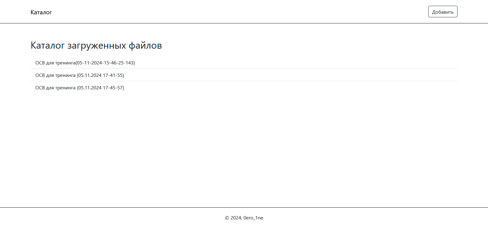
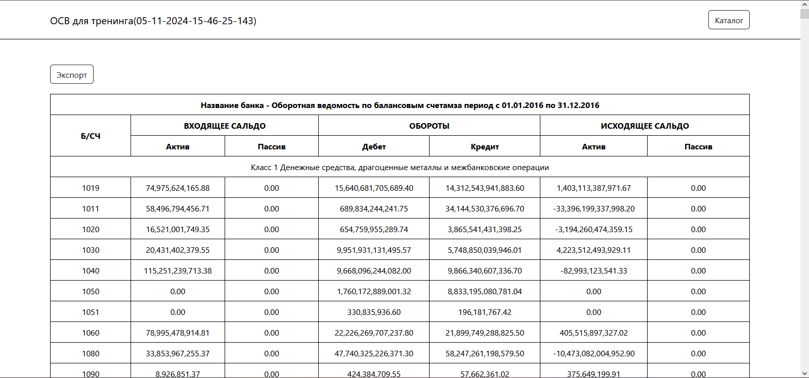
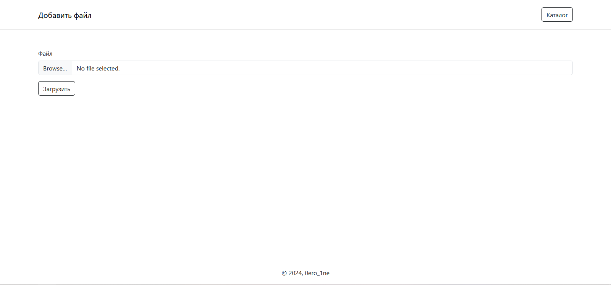

# Excel Reader

Данный проект является Web-приложением, котороено написано с использованием ASP.NET Core и C#. В роли базы данных выступает Microsoft SQL Server. В роли ORM - Entity Framework 8.

## Инструкция для запуска

Порядок запуска проекта представлен следующими шагами:

1. Установка Microsoft SQL Server и создание базы данных с таблицами. Для этого в папке SQL лежит скрипт, который создаст всю БД за вас.
2. Миграция сущностей БД в модели проекта. Для этого нужно глобально установить Dotnet EF - инструмент для работы с миграциями. Установить его можно с помощью следующей команды:

    `dotnet tool install --global dotnet-ef`

    После этого в директории проекта запустить следующую команду, что сгенерировать модели из сущносте БД:

    ```PowerShell
    dotnet ef dbcontext scaffold `
    "Name=ConnectionStrings:DefaultConnection" `
    Microsoft.EntityFrameworkCore.SqlServer `
    --output-dir Models `
    --context Task2DbContext `
    --no-build `
    --force
    ```

    Вторая строка команды - получение строки подключения к БД из файла `appsettings.json`. В этом файле нужно будет поменять некоторые свойства на свои (Server, user, password и т.д.).

## Как пользоваться

Данное приложение читает excel файлы, макет которых можно найти в папке `wwwroot/files`. Приложение читает данные из файла и сохраняет их в БД.
На главной странице можно увидеть список файлов, которые есть на сервере.



По нажатию на один из элементов списка, откроется страница файла, которая содержит в себе таблицу со определёнными значениями. Также есть кнопка, по нажатию которой скачается файл со всеми значениями в JSON формате.



Если вы хотите добавить новые данные, то перейдите на страницу `/home/add`. На данной странице представлена форма, в которой нужно выбрать .xls (.xlsx) файл. После загрузки, пользователя перенаправит на главную страницу, где будет представлено сообщение об успешном (неуспешном) сохранении файла.


